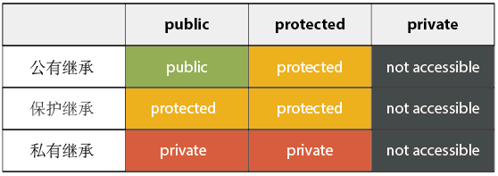

###217 Contains Duplicate
URL: https://leetcode.com/problems/contains-duplicate/ 
Given an array of integers, find if the array contains any duplicates. Your function should return true if any value appears at least twice in the array, and it should return false if every element is distinct.

Code:

	class Solution {
	//公有函数成员
	public:													//1
		//函数类型为bool
    	bool containsDuplicate(vector<int>& nums) {			//2
        	unordered_map<int, bool> m;						//3
        	for (auto item : nums) {						//4
        		//如果unordered_map::find不等于.end,说明存在相同元素
            	if (m.find(item) != m.end()) return true;	//5
            	//标记找到的元素
            	m[item] = true;
        	}
        	return false;
    	}
	};

###1 公有继承

	public:

例子：

	class A {
	public:
	    int x;
	protected:
	    int y;
	private:
	    int z;
	};

	class B : public A {
	    // x is public
	    // y is protected
	    // z is not accessible from B
	};

	class C : protected A {
	    // x is protected
	    // y is protected
	    // z is not accessible from C
	};

	class D : private A {
	    // x is private
	    // y is private
	    // z is not accessible from D
	};

表格： 
 

###2 vector<int>

在 C++ 中，容器向量 (vector) 支持容器抽象的语义，同时也是一个类模版。
头文件：`include <vector>`, vector<int> 是一种数据类型。vector 的存储空间是连续的，list 不是连续存储的。

包含头文件：

	#include <vector>

vector 属于 std 命名域：

	//命名限定
	using std::vector;
	vector vlnts;
	//连在一起使用全名
	std::vector vlnts;
	//使用全局的命名域方式
	using namespace std;

vector 的初始化:

	vector			//创建一个空的vector
	vector c1(c2)	//复制一个vector
	vector c(n)		//创建一个vector，含有n个数据，数据均以缺省构造产生
	vector c(n, elem)	//创建一个含有n个elem拷贝的vector
	vector c(beg, end)	//创建一个含有n个elem拷贝的vector

###3 unordered_map

Unordered maps are associative containers that store elements formed by the combination of a _key value_ and a _mapped value_, and which allows for fast retrieval of individual elements based on their keys.
In an `unordered_map`, the _key value_ is generally used to uniquely identify the element, while the _mapped value_ is an object with the content associated to this key. Types of key and mapped value may differ.

	template < class Key,	//unordered_map::key_type
			   class T,		//unordered_map::mapped_type
			 > class unordered_map;

###4 for(auto item : nums)

C++11 中的用法，即 range-based for loop. 其中 counts 应满足：`begin(counts)`, `end(counts)` 是合法的。
它等价于：

	for(some_iterator p = begin(counts); p != end(counts); ++p)
	&& some_type count = *p;

另外两种用法：

	for(auto& count : counts)	//count赋值
	for(auto&& count : counts)	//count引用, 等价于C++14中的
	for(count : counts)

###5 unordered_map::find

std::unordered_map::find 的格式：
	
	iterator 		find (const key_type& k);
	const_iterator	find (const key_type& k) const;

Searches the container for an element with _k_ as key and returns an iterator to it if found, otherwise it returns an iterator to unordered_map::end (the element past the end of the container).
Another member function, `unordered_map::count`, can be used to just check whether a particular key exists.
The mapped value can also be accessed directly by using member functions at or operator[].