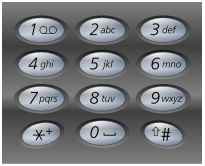

###Letter Combinations of a Phone Number
URL: https://leetcode.com/problems/letter-combinations-of-a-phone-number/ 
Given a digit string, return all possible letter combinations that the number could represent.

A mapping of digit to letters (just like on the telephone buttons) is given below. 

	Input:Digit string "23"
	Output: ["ad", "ae", "af", "bd", "be", "bf", "cd", "ce", "cf"].

####Note:
Although the above answer is in lexicographical order, your answer could be in any order you want.

__Code:__

	vector<string> letterCombinations(string digits) {
	    char  phone[10][4]={ {' ',  '\0', '\0', '\0' }, //0
	                         {'\0', '\0', '\0', '\0' }, //1
	                         {'a',  'b',  'c',  '\0' }, //2
	                         {'d',  'e',  'f',  '\0' }, //3
	                         {'g',  'h',  'i',  '\0' }, //4
	                         {'j',  'k',  'l',  '\0' }, //5
	                         {'m',  'n',  'o',  '\0' }, //6
	                         {'p',  'q',  'r',  's'  }, //7
	                         {'t',  'u',  'v',  '\0' }, //8
	                         {'w',  'x',  'y',  'z'  }  //9
	                       };

	    vector<string> result;
	    if (digits.size()<=0){
	        result.push_back("");
	        return result;
	    }
	    for( int i=0; i<digits.size(); i++ ) {
	        if (!isdigit(digits[i])) {
	            vector<string> r;
	            return r;
	        } 
	        int d = digits[i] - '0';
	        if (result.size()<=0){
	            for( int j=0; j<4 && phone[d][j]!='\0'; j++ ){
	                string s;
	                s += phone[d][j];
	                result.push_back(s);
	            }
	            continue;
	        }
	        vector<string> r;
	        for (int j=0; j<result.size(); j++){
	            for( int k=0; k<4 && phone[d][k]!='\0'; k++ ){
	                string s = result[j] + phone[d][k];
	                //sort(s.begin(), s.end());
	                r.push_back(s); 
	            }
	        }
	        result = r;
	    }
	    //sort(result.begin(), result.end());

	    return result; 
	}