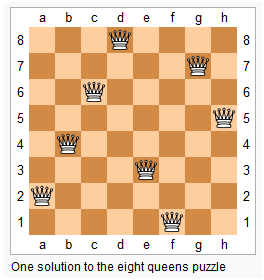

###N-Queens
URL: https://leetcode.com/problems/n-queens/ 
The n-queens puzzle is the problem of placing n queens on an n×n chessboard such that no two queens attack each other.

Given an integer n, return all distinct solutions to the n-queens puzzle.

Each solution contains a distinct board configuration of the n-queens' placement, where `'Q'` and `'.'` both indicate a queen and an empty space respectively.

For example, 
There exist two distinct solutions to the 4-queens puzzle:

	[
	 [".Q..",  // Solution 1
	  "...Q",
	  "Q...",
	  "..Q."],

	 ["..Q.",  // Solution 2
	  "Q...",
	  "...Q",
	  ".Q.."]
	]

__Code:__

	vector< vector<string> > solveNQueens(int n); 
	void solveNQueensRecursive(int n, int currentRow, vector<int>& solution, vector< vector<string> >& result); 
	bool isValid(int attemptedColumn, int attemptedRow, vector<int> &queenInColumn); 

	vector< vector<string> > solveNQueens(int n) {
	    vector< vector<string> > result;
	    vector<int> solution(n);

	    solveNQueensRecursive(n, 0, solution, result);

	    return result;    
	}

	//The following recursion is easy to understand. Nothing's tricky.
	//  1) recursively find all of possible columns row by row.
	//  2) solution[] array only stores the columns index. `solution[row] = col;` 
	void solveNQueensRecursive(int n, int currentRow, vector<int>& solution, vector< vector<string> >& result) {
	    //if no more row need to do, shape the result
	    if (currentRow == n){
	        vector<string> s;
	        for (int row = 0; row < n; row++) {
	            string sRow;
	            for (int col = 0; col < n; col++) {
	                sRow = sRow + (solution[row] == col ? "Q" :"." );
	            }
	            s.push_back(sRow);
	        }
	        result.push_back(s);
	        return;
	    }

	    //for each column
	    for (int col = 0; col < n; col++) {
	        //if the current column is valid
	        if (isValid(col, currentRow, solution) ) {
	            //place the Queue
	            solution[currentRow] = col;
	            //recursively put the Queen in next row
	            solveNQueensRecursive(n, currentRow+1, solution, result);
	        }
	    } 
	}

	//Attempting to put the Queen into [row, col], check it is valid or not
	//Notes: 
	//  1) we just checking the Column not Row, because the row cannot be conflicted
	//  2) to check the diagonal, we just check |x'-x| == |y'-y|, (x',y') is a Queen will be placed
	bool isValid(int attemptedColumn, int attemptedRow, vector<int> &queenInColumn) {

	    for(int i=0; i<attemptedRow; i++) {
	        if (attemptedColumn == queenInColumn[i]  || 
	            abs(attemptedColumn - queenInColumn[i]) == abs(attemptedRow - i)) {
	            return false;
	        } 
	    }
	    return true;
	}