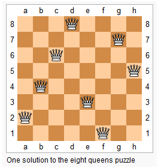

###N-Queens
URL: https://leetcode.com/problems/n-queens-ii/ 
Follow up for N-Queens problem.

Now, instead outputting board configurations, return the total number of distinct solutions.

__Code:__

	int totalNQueens(int n); 
	void solveNQueensRecursive(int n, int currentRow, vector<int>& solution, int& result); 
	bool isValid(int attemptedColumn, int attemptedRow, vector<int> &queenInColumn); 

	int totalNQueens(int n) {
	    int result=0;
	    vector<int> solution(n);

	    solveNQueensRecursive(n, 0, solution, result);

	    return result;    
	}

	// the solution is same as the "N Queens" problem.
	void solveNQueensRecursive(int n, int currentRow, vector<int>& solution, int& result) {

	    for (int i = 0; i < n; i++) {
	        if (isValid(i, currentRow, solution) ) {
	            if (currentRow+1 == n){
	                result++;
	                continue;
	            }
	            solution[currentRow] = i;
	            solveNQueensRecursive(n, currentRow+1, solution, result);
	        }
	    } 
	}

	bool isValid(int attemptedColumn, int attemptedRow, vector<int> &queenInColumn) {

	    for(int i=0; i<attemptedRow; i++) {
	        if (attemptedColumn == queenInColumn[i]  || 
	            abs(attemptedColumn - queenInColumn[i]) == abs(attemptedRow - i)) {
	            return false;
	        } 
	    }
	    return true;
	}