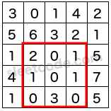

###Range Sum Query 2D - Immutable
URL: https://leetcode.com/problems/range-sum-query-2d-immutable/ 
Given a 2D matrix _matrix_, find the sum of the elements inside the rectangle defined by its upper left corner (_row1_, _col1_) and lower right corner (_row2_, _col2_). 
 
The above rectangle (with the red border) is defined by (row1, col1) = __(2, 1)__ and (row2, col2) = __(4, 3)__, which contains sum = __8__.

####Example:

	Given matrix = [
	  [3, 0, 1, 4, 2],
	  [5, 6, 3, 2, 1],
	  [1, 2, 0, 1, 5],
	  [4, 1, 0, 1, 7],
	  [1, 0, 3, 0, 5]
	]

	sumRegion(2, 1, 4, 3) -> 8
	sumRegion(1, 1, 2, 2) -> 11
	sumRegion(1, 2, 2, 4) -> 12

####Note:

1. You may assume that the matrix does not change.
2. There are many calls to _sumRegion_ function.
3. You may assume that _row1_ ≤ _row2_ and _col1_ ≤ _col2_.

####Solution

	class NumMatrix {
	private:
	    vector<vector<int>> acc;
	public:
	    NumMatrix(vector<vector<int>> &matrix) {
	        if (matrix.empty()) return;
	        int n = matrix.size(), m = matrix[0].size();
	        acc.resize(n + 1, vector<int>(m + 1));
	        for (int i = 0; i <= n; ++i) acc[i][0] = 0;
	        for (int j = 0; j <= m; ++j) acc[0][j] = 0;
	        for (int i = 1; i <= n; ++i) {
	            for (int j = 1; j <= m; ++j) {
	                acc[i][j] = acc[i][j-1] + acc[i-1][j] - acc[i-1][j-1] + matrix[i-1][j-1];
	            }
	        } 
	    }

	    int sumRegion(int row1, int col1, int row2, int col2) {
	        return acc[row2+1][col2+1] - acc[row1][col2+1] - acc[row2+1][col1] + acc[row1][col1];
	    }
	};

	// Your NumMatrix object will be instantiated and called as such:
	// NumMatrix numMatrix(matrix);
	// numMatrix.sumRegion(0, 1, 2, 3);
	// numMatrix.sumRegion(1, 2, 3, 4);