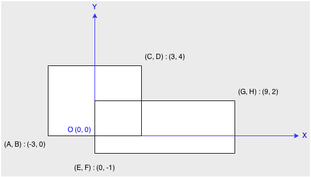

###Rectangle Area
URL: https://leetcode.com/problems/rectangle-area/ 
Find the total area covered by two __rectilinear__ rectangles in a __2D__ plane. 
Each rectangle is defined by its bottom left corner and top right corner as shown in the figure. 
 
Assume that the total area is never beyond the maximum possible value of int.

__My Note:__
其实有两个思路：

1. 目标 = 矩形A面积 + 矩形B面积 - 重叠部分面积
2. 目标 = 新的大矩形C - 与矩形AB的差集

__Code:__

	#include <iostream>
	using namespace std;

	//自定义namespace
	namespace leetcode 																				//1
	{
	    class Point {
	        public:
	            Point(int _x, int _y):x(_x),y(_y) {}
	            int x, y;
	    };

	    class Rectangle {
	        public:
	        	//定义矩形左下和右上顶点
	            Rectangle(int a, int b, int c, int d):topLeft(a,d), bottomRight(c,b) { }
	            //定义矩形面积
	            int Area(){
	                return (bottomRight.x - topLeft.x)*(topLeft.y - bottomRight.y); 
	            }

	            int InclusiveArea (Rectangle &r){
	                // I include it
	                if (r.topLeft.x >= topLeft.x && r.bottomRight.x <= bottomRight.x &&
	                        r.topLeft.y <= topLeft.y && r.bottomRight.y >= bottomRight.y ) {
	                    return this->Area();
	                }
	                // it includes me
	                if (r.topLeft.x <= topLeft.x && r.bottomRight.x >= bottomRight.x &&
	                        r.topLeft.y >= topLeft.y && r.bottomRight.y <= bottomRight.y ) {
	                    return r.Area();
	                }
	                // 0 - no inclusive
	                return 0;
	            }

	            //重叠
	            int OverlappedArea(Rectangle &r) {
	                int overlap_x = max(0, min(r.bottomRight.x, bottomRight.x) - max(r.topLeft.x, topLeft.x));
	                int overlap_y = max(0, min(r.topLeft.y, topLeft.y) - max(r.bottomRight.y, bottomRight.y));
	                return overlap_x * overlap_y;
	            }

	            Point topLeft;
	            Point bottomRight;
	    };
	};

	int computeArea(int A, int B, int C, int D, int E, int F, int G, int H) {
		//导入namespace leetcode所有名称
	    using namespace leetcode;
	    Rectangle r1(A,B,C,D);
	    Rectangle r2(E,F,G,H);
	    int area = r1.InclusiveArea(r2);
	    if (area > 0) return area;
	    //两个矩形面积=矩形面积和-重叠部分面积
	    return r1.Area() + r2.Area() - r1.OverlappedArea(r2);
	}

	int main() 
	{
	    //16
	    cout << "16 : " << computeArea(-1, -1, 1, 1, -2, -2, 2, 2) << endl;
	    //16
	    cout << "16 : " << computeArea(-2, -2, 2, 2, -1, -1, 1, 1) << endl;
	    //17
	    cout << "17 : " << computeArea(-2, -2, 2, 2, -4, 3, -3, 4) << endl;
	    //45
	    cout << "45 : " << computeArea(-3, -0, 3, 4, 0, -1, 9, 2) << endl;
	    //24
	    cout << "24 : " << computeArea(-2, -2, 2, 2, -3, -3, 3, -1) << endl;
	    return 0;
	}

###1 namespace

Namespace provide a method for preventing name conflicts in large projects.

####Syntax:

	namespace ns_name { declarations }			//(1)	
	inline namespace ns_name { declarations }	//(2)	(since C++11)
	namespace { declarations }					//(3)	
	ns_name::name								//(4)	
	using namespace ns_name;					//(5)	
	using ns_name::name;						//(6)	
	namespace name = qualified-namespace ;		//(7)	
	namespace ns_name::name						//(8)	(since C++17)

1. Named namespace definition for the namespace `ns_name`.
2. Inline namespace definition for the namespace `ns_name`. Declarations inside `ns_name` will be visible in its enclosing namespace.
3. Unnamed namespace definition. Its members have potential scope from their point of declaration to the end of the translation unit, and have internal linkage.
4. Namespace names (along with class names) can appear on the left hand side of the scope resolution operator, as part of qualified name lookup.
5. using-directive: From the point of view of unqualified name lookup of any name after a using-directive and until the end of the scope in which it appears, every name from `namespace-name` is visible as if it were declared in the nearest enclosing namespace which contains both the using-directive and `namespace-name`.
6. using-declaration: makes the symbol `name` from the namespace `ns_name` accessible for unqualified lookup as if declared in the same class scope, block scope, or namespace as where this using-declaration appears.
7. `namespace-alias-definition`: makes `name` a synonym for another namespace: see namespace alias
8. nested namespace definition: `amespace A::B::C {` is equivalent to `namespace A { namespace B { namespace C {`

