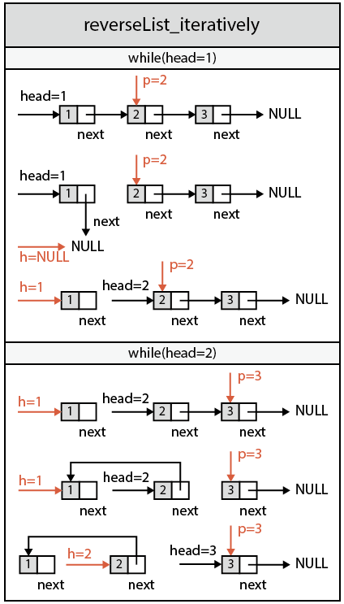

###Reverse Linked List
URL: https://leetcode.com/problems/reverse-linked-list/ 
Reverse a singly linked list.

__Hint:__
A linked list can be reversed either iteratively or recursively. Could you implement both?

__Code:__

	/**
	 * Definition for singly-linked list.
	 * struct ListNode {
	 *	   //整型变量val存放结点的数据
	 *     int val;
	 *	   //*next是指针域，指向下一个结点
	 *     ListNode *next;
	 *	   //初始化方式支持ListNode(intx)，即val＝x, next=NULL
	 *     ListNode(int x) : val(x), next(NULL) {}
	 * };
	 */
	class Solution {
	public:
		//迭代
	    ListNode* reverseList_iteratively(ListNode* head) {
	        ListNode *h=NULL, *p=NULL;
	        while (head){
	            p = head->next;
	            head->next = h;
	            h = head;
	            head = p;
	        }
	        return h;
	    }
	    //递归
	    ListNode* reverseList_recursively(ListNode* head) {
	    	//先判断递归结束条件
	        if (head==NULL || head->next==NULL) return head;
	        //递归调用函数reverseList_recursively()
	        ListNode *h = reverseList_recursively(head->next);
	        head->next->next = head;
	        head->next = NULL;
	        return h;   
	    }
	};

__Run:__

	class Solution {
	public:
		ListNode* reverseList_iteratively(ListNode* head) {
			ListNode *h=NULL, *p=NULL;
			while(head=1) {
				p = head-next = 1->next = 2;
				head->next = 1->next = h = NULL;
				h = head = 1;
				head = p = 2;
			} (head=2) {
				p = head-next = 2->next = 3;
				head->next = 2->next = h = 1;
				h = head = 2;
				head = p = 3;
			} (head=..)
		}

		ListNode* reverseList_recursively(ListNode* head=1) {
		if (head=1==NULL || head->next=2==NULL) /*FALSE*/;
		ListNode *h = reverseList_recursively(head->next=2);
		head->next->next = head;
		head->next = NULL;
		return h;
		} reverseList_recursively(head=2) {
		if (head=2==NULL || head->next=3==NULL) /*FALSE*/;
		ListNode *h = reverseList_recursively(head->next=3);
		head->next->next = head;
		head->next = NULL;
		return h;
		} reverseList_recursively(head=3) {
		if (head=3==NULL || head->next=NULL==NULL) return head=3;
		}
	}

reverseList_iteratively() 的运行图： 
 