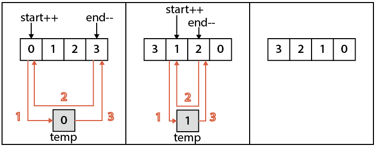
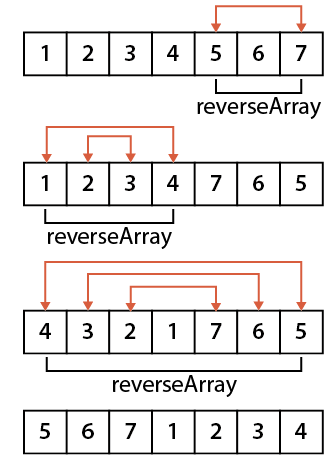

###189 Rotate Array
URL:https://leetcode.com/problems/rotate-array/ 
Rotate an array of _n_ elements to the right by _k_ steps. 
For example, with _n_ = 7 and _k_ = 3, the array `[1,2,3,4,5,6,7]` is rotated to `[5,6,7,1,2,3,4]`.
__Note:__
Try to come up as many solutions as you can, there are at least 3 different ways to solve this problem.
__Hint:__
Could you do it in-place with O(1) extra space?
Related problem: Reverse Words in a String II

__Code:__

	#include <stdlib.h>
	#include <time.h>
	#include <iostream>
	using namespace std;

	//函数变量(整数数组，整数(开始位置)，整数(结束位置))
	void reverseArray(int nums[],int start, int end){	//1
		//定义临时变量
	    int temp;
	    //当start比end小，交换，并且start右移，end左移
	    while(start < end){
	        int temp = nums[start];
	        nums[start++] = nums[end];
	        nums[end--] = temp;
	    }
	}

	/*
	 * this solution is so-called three times rotate method
	 * because (X^TY^T)^T = YX, so we can perform rotate operation three times to get the result
	 * obviously, the algorithm consumes O(1) space and O(n) time
	 */

	void rotate1(int nums[], int n, int k) {			//2
		//如果k小于等于0，结束
	    if (k<=0) return;
	    k %= n; 
	    //依次对数组右边，左边，全部调用一次reverseArray
	    reverseArray(nums, n-k, n-1);
	    reverseArray(nums, 0, n-k-1);
	    reverseArray(nums, 0, n-1);    
	}

	/*
	 * How to change [0,1,2,3,4,5,6] to [4,5,6,0,1,2,3] by k = 3?
	 * We can change by following rules: 
	 *     [0]->[3], [3]->[6], [6]->[2],  [2]->[5], [5]->[1], [1]->[4]
	 */
	void rotate2(int nums[], int n, int k) {
	    //k大于0时，进入函数主体
	    if (k<=0) return;
	    //k对n取模，使k小于n
	    k %= n;
	    //currentIndex=0, newIndex=k
	    int currIdx=0, newIdx=k;
	    //临时变量
	    int tmp1 = nums[currIdx], tmp2; 
	    int origin = 0;

	    for(int i=0; i<n; i++){
	    	//把nums[currIdx]的值赋给nums[newIdx],在tmp1中保留nums[newIdx]的值
	        tmp2 = nums[newIdx];
	        nums[newIdx] = tmp1;
	        tmp1 = tmp2; 

	        currIdx = newIdx;

	        //if we meet a circle, move the next one
	        if (origin == currIdx) {
	            origin = ++currIdx;
	            tmp1 = nums[currIdx];
	        }
	        newIdx = (currIdx + k) % n;

	    } 
	}

	void rotate(int nums[], int n, int k) {
	    if (random()%2==0) {
	        cout << "[1] ";
	        return rotate1(nums, n, k);
	    }
	    cout << "[2] ";
	    return rotate2(nums, n, k);
	}

	//打印
	void printArray(int nums[], int n) {
	    cout << "[ " ;
	    for(int i=0; i<n; i++) {
	        cout << nums[i] << ((i==n-1)? " " : ", ");
	    }
	    cout << "]" << endl;
	}

	//初始化一个，第一个元素为0，每次递增1的整数数组
	void initArray(int nums[], int n) {
	    for(int i=0; i<n; i++) {
	        nums[i] = i;
	    }
	}

	int main(int argc, char**argv) {
	    
	    srand(time(0));									//2

	    int nums[] = {0, 1, 2, 3, 4, 5, 6, 7, 8, 9 };

	    const int n = sizeof(nums)/sizeof(int);

	    for (int i=0; i<n; i++) {
	        initArray(nums, n);
	        rotate(nums, n, i);
	        printArray(nums, n);
	    }
	    return 0;
	}

###1 reverseArray(int nums[], int start, int end)
 

###2 rotate1(int nums[], int n, int k)
 

###3 srand()

rand() 和 srand() 是 C++ 中的随机函数

####3.1 rand()

函数名：rand 
功能：随机数发生器 
用法：

	int rand(void);

所在头文件：`stdlib.h` 
函数说明：

- `rand()` 的内部实现是用线性同余法做的，它不是真的随机数，因其周期特别长，故在一定的范围里可看成是随机的。
- `rand()` 返回一随机数值的范围在0~RAND_MAX 间。`RAND_MAX` 的范围最少是在32767之间(int)。用 
`unsigned int` 双字节是 65535，四字节是 4294967295 的整数范围。0~RAND_MAX每个数字被选中的机率是相同的。                      
- 用户未设定随机数种子时，系统默认的随机数种子为 1。
- `rand()` 产生的是伪随机数字，每次执行时是相同的;若要不同,用函数 `srand()` 初始化它。

####3.2 srand()

函数名：srand 
功能：初始化随机数发生器 
用法：

	void srand(unsigned int seed);

所在头文件：`stdlib.h` 
函数说明：

- `srand()` 用来设置 `rand()` 产生随机数时的随机数种子。
- 参数 seed 必须是个整数，通常可以利用 `time(0)` 的返回值或 NULL 来当做 seed.
- 如果每次 seed 都设相同值，`rand()` 所产生的随机数值每次就会一样。