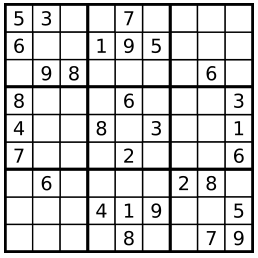
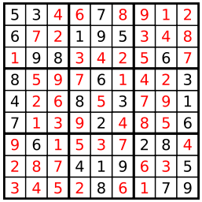

###Sudoku Solver
URL: https://leetcode.com/problems/sudoku-solver/ 
Write a program to solve a Sudoku puzzle by filling the empty cells. 
Empty cells are indicated by the character`'.'`. 
You may assume that there will be only one unique solution. 
 
A sudoku puzzle... 
 
...and its solution numbers marked in red.

__Code:__