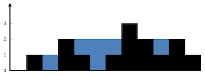

###Trapping Rain Water
URL: https://leetcode.com/problems/trapping-rain-water/ 
Given _n_ non-negative integers representing an elevation map where the width of each bar is 1, compute how much water it is able to trap after raining.

For example,  
Given `[0,1,0,2,1,0,1,3,2,1,2,1]`, return `6`. 
 
The above elevation map is represented by array [0,1,0,2,1,0,1,3,2,1,2,1]. In this case, 6 units of rain water (blue section) are being trapped.

__Code:__

	#include <stdio.h>
	/*
	 * The idea is:
	 *    1) find the highest bar.
	 *    2) traverse the bar from left the highest bar.
	 *       becasue we have the highest bar in right, so, any bar higher than its right bar(s) can contain the water.
	 *    3) traverse the bar from right the highest bar.
	 *       becasue we have the highest bar in left, so, any bar higher than its left bar(s) can contain the water.
	 *
	 * The code below is quite clear!
	 *
	 */
	int trap(int a[], int n) {
	    int result = 0;

	    //find the highest value/position
	    int maxHigh = 0;
	    int maxIdx = 0;
	    for(int i=0; i<n; i++){
	        if (a[i] > maxHigh){
	            maxHigh = a[i];
	            maxIdx = i;
	        }
	    }

	    //from the left to the highest postion
	    int prevHigh = 0;
	    for(int i=0; i<maxIdx; i++){
	        if(a[i] > prevHigh){
	            prevHigh = a[i];
	        }
	        result += (prevHigh - a[i]);
	    }

	    //from the right to the highest postion
	    prevHigh=0;
	    for(int i=n-1; i>maxIdx; i--){
	        if(a[i] > prevHigh){
	            prevHigh = a[i];
	        }
	        result += (prevHigh - a[i]);
	    }

	    return result;
	}

	#define TEST(a) printf("%d\n", trap(a, sizeof(a)/sizeof(int)))
	int main()
	{
	    int a[]={2,0,2};
	    TEST(a);
	    int b[]={0,1,0,2,1,0,1,3,2,1,2,1};
	    TEST(b);
	    return 0;
	}