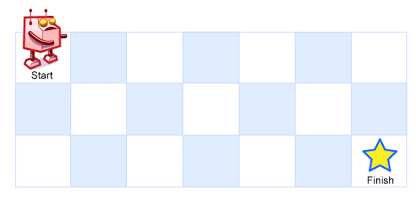

###Unique Paths
URL: https://leetcode.com/problems/unique-paths/ 
A robot is located at the top-left corner of a m x n grid (marked 'Start' in the diagram below). 
The robot can only move either down or right at any point in time. The robot is trying to reach the bottom-right corner of the grid (marked 'Finish' in the diagram below). 
How many possible unique paths are there? 
 

Above is a 3 x 7 grid. How many possible unique paths are there? 
__Note:__ m and n will be at most 100.

__Code:__

	void printMatrix(int*a, int m, int n);

	/*
	 * Dynamic Programming
	 *
	 * We have a dp[i][j] represents  how many paths from [0][0] to hear. So, we have the following DP formuler:
	 *
	 *    dp[i][j] =  1  if i==0 || j==0        //the first row/column only have 1 uniqe path.
	 *             =  dp[i-1][j] + dp[i][j-1]   //the path can be from my top cell and left cell.
	 */
	int uniquePaths(int m, int n) {
	    int* matrix = new int[m*n];
	    for (int i=0; i<m; i++){
	        for (int j=0; j<n; j++){
	            if(i==0 || j==0){
	                matrix[i*n+j]=1;
	            }else{
	                matrix[i*n+j] = matrix[(i-1)*n+j] + matrix[i*n+j-1];
	            }
	        }
	    } 
	    int u = matrix[m*n-1];
	    delete[] matrix;
	    return u;
	}