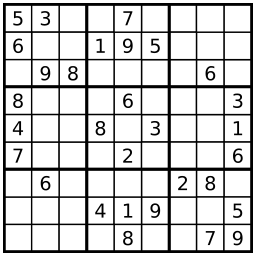

###Valid Sudoku
URL: https://leetcode.com/problems/valid-sudoku/ 
Determine if a Sudoku is valid, according to: [Sudoku Puzzles - The Rules](http://sudoku.com.au/TheRules.aspx). 
The Sudoku board could be partially filled, where empty cells are filled with the character `'.'`. 

A partially filled sudoku which is valid.

__Note:__
A valid Sudoku board (partially filled) is not necessarily solvable. Only the filled cells need to be validated.

__Code:__

	class Solution {
	public:
	    bool isValidSudoku(vector<vector<char> > &board) {
	        const int cnt = 9;
	        bool row_mask[cnt][cnt] = {false};
	        bool col_mask[cnt][cnt] = {false};
	        bool blk_mask[cnt][cnt] = {false};
	        //check each rows and cols
	        //限定row循环条件
	        for(int r=0; r<board.size(); r++){
	        	//限定col循环条件
	            for (int c=0; c<board[r].size(); c++){
	            	//检查是存在数字，不是，跳过此次循环
	                if (!isdigit(board[r][c])) continue;	//1
	                //将数独中的数组转换为数组下标
	                int idx =  board[r][c] - '0' - 1;
	                
	                //检查行，如果该位置已经为true，则返回false
	                if (row_mask[r][idx] == true) {
	                    return false;
	                }
	                row_mask[r][idx] = true;
	                
	                //检查列
	                if (col_mask[c][idx] == true) {
	                    return false;
	                }
	                col_mask[c][idx] = true;
	                
	                //检查宫
	                int blk = (r/3) * 3 + (c/3);
	                if (blk_mask[blk][idx] == true) {
	                    return false;
	                }
	                blk_mask[blk][idx] = true;
	            }
	        }
	        
	        return true;
	    }
	};

##1 isdigit

头文件：`<cctype>`

格式：

	int isdigit (int c);

检查 _c_ 是否是十进制数字字符. 十进制数字包括：0 1 2 3 4 5 6 7 8 9. 
返回值：如果 _c_ 是一个十进制数字则返回一个不为 0 的值(比如 true)，否则返回 0 (比如 false).
